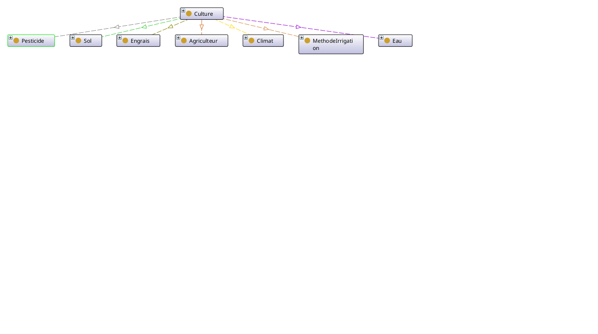

# 🌱 Ontologie Agricole Sémantique

Bienvenue dans mon projet d'ontologie sémantique dédiée au domaine de **l'agriculture intelligente**.

## 🎯 Domaine et Objectifs

Cette ontologie modélise les connaissances du domaine **agricole** en utilisant les technologies du Web Sémantique (RDF, RDFS, OWL). Elle permet de :

- Structurer les connaissances sur les cultures, sols, climats et pratiques agricoles
- Faciliter l'échange de données entre systèmes agricoles
- Soutenir la prise de décision pour une agriculture durable

## ✅ Justification du Choix

### 🌍 Pertinence Sociétale 
L'agriculture est cruciale pour :
- La sécurité alimentaire mondiale
- La durabilité environnementale
- Le développement économique rural

### 🧠 Richesse Conceptuelle
Le domaine couvre :
- 12+ types de cultures
- 6+ types de sols
- 5+ systèmes d'irrigation
- 10+ paramètres agronomiques

### 💡 Utilité Pratique
Applications possibles :
- Recommandation de cultures adaptées
- Optimisation des ressources (eau, engrais)
- Détection précoce de risques
- Gestion intelligente des exploitations

## 🧠 Concepts Clés (Classes Principales)

| Classe                | Description                                  | Exemples                          |
|-----------------------|----------------------------------------------|-----------------------------------|
| `Culture`             | Plantes cultivées                            | Tomate, Blé, Maïs                 |
| `Sol`                 | Types de sols agricoles                      | Argileux, Sableux, Calcaire       |
| `Climat`              | Conditions climatiques                       | Tempéré, Tropical, Méditerranéen  |
| `Engrais`             | Fertilisants                                 | Azote, Phosphore, Potassium       |
| `Agriculteur`         | Exploitants agricoles                        | Jean Dupont, Marie Lambert        |
| `MethodeIrrigation`   | Techniques d'arrosage                        | Goutte-à-goutte, Aspersion        |
| `Eau`                 | Type D'arrosage                              | Naturel, Intervention Humaine     |


## 🖼️ Visualisation de l’ontologie


## 🔗 Relations (Propriétés)

### Propriétés d'Objet

| Relation              | Domaine → Portée           | Description                     |
|-----------------------|----------------------------|---------------------------------|
| `utiliseSol`          | Culture → Sol              | Sol requis par la culture       |
| `utiliseEngrais`      | Culture → Engrais          | Engrais recommandé              |
| `consommeEau`         | Culture → Eau              | Besoins en irrigation           |
| `aClimat`             | Culture → Climat           | Climat optimal                  |
| `utilisePesticide`    | Culture → Pesticide        | Traitements phytosanitaires     |
| `cultivePar`          | Culture → Agriculteur      | Responsable de la culture       |
| `methodeIrrigation`   | Culture → MethodeIrrigation| Technique d'arrosage utilisée   |

### Propriétés de Données

| Propriété            | Domaine    | Type       | Description                     |
|----------------------|------------|------------|---------------------------------|
| `datePlantation`     | Culture    | date       | Date de semis/plantation        |
| `quantiteEau`        | Culture    | decimal    | Besoin en eau (L)               |
| `rendement`          | Culture    | decimal    | Rendement (kg/m²)               |
| `superficie`         | Culture    | decimal    | Surface cultivée (ha)           |
| `dureeCroissance`    | Culture    | integer    | Durée croissance (jours)        |
| `prixMarche`         | Culture    | decimal    | Prix moyen (€/kg)               |


## 🌐 Namespaces Utilisés

| Préfixe | URI                                      | Utilisation                     |
|---------|------------------------------------------|---------------------------------|
| `agri:` | `http://www.example.org/agriculture#`    | Concepts agricoles              |
| `rdf:`  | `http://www.w3.org/1999/02/22-rdf-syntax-ns#` | Syntaxe RDF de base       |
| `rdfs:` | `http://www.w3.org/2000/01/rdf-schema#`  | Schéma RDFS                    |
| `owl:`  | `http://www.w3.org/2002/07/owl#`         | Modélisation OWL               |
| `xsd:`  | `http://www.w3.org/2001/XMLSchema#`      | Types de données               |

## 📊 Requêtes SPARQL Exemples

### 1. Lister toutes les cultures avec leurs méthodes d'irrigation (requete 1)
Utilité : Cette requête est utile pour :
- Comprendre quelles méthodes d'irrigation sont utilisées pour chaque culture
- Identifier les pratiques d'arrosage dominantes
- Préparer une analyse comparative des techniques d'irrigation

### 2. Cultures utilisant des pesticides biologiques (requete 2)
Utilité : Cette requête permet de :
- Identifier les cultures cultivées en agriculture biologique
- Évaluer la proportion de cultures utilisant des pesticides biologiques
- Cibler les produits pour un marché bio

### 3. Consommation d'eau par culture: tri décroissant (requete 3)
Utilité : Cette requête sert à :
- Identifier les cultures les plus gourmandes en eau
- Optimiser la gestion des ressources hydriques
- Prioriser les cultures pour des systèmes d'irrigation efficaces

### 4. Cultures cultivées par Jean Dupont (requete 4)
Utilité : Cette requête permet de :
- Connaître le portfolio de cultures d'un agriculteur spécifique
- Analyser les choix culturaux d'un exploitant
- Préparer un bilan d'activité pour un agriculteur donné

### 5. Cultures adaptées au climat méditerranéen (requete 5)
Utilité : Cette requête est utile pour :
- Identifier les cultures appropriées pour une zone climatique spécifique
- Planifier des rotations culturales adaptées au climat
- Conseiller les agriculteurs sur les cultures les mieux adaptées

### 6. Statistiques de production par agriculteur (requete 6)
Utilité : Cette requête permet de :
- Calculer le nombre total de cultures par agriculteur
- Déterminer le rendement moyen des cultures pour chaque exploitant
- Comparer les performances entre agriculteurs

## 🗂 Structure du Dépôt
```plaintext
Ontologie/
├── agriculture.owx        # Fichier OWL/XML complet de l'ontologie
├── agriculture.rdf        # Export RDF/XML de la modélisation en RDF et RDFS
├── agriculture.ttl        # Fichier Turtle representant les tripletes
├── regles_swrl.swrl       # Fichier contenant les règles SWRL
Requetes/
├── requete1.sparql
├── requete2.sparql
├── requete3.sparql
├── requete4.sparql
├── requete5.sparql
├── requete6.sparql
Screenshots/
├── requete1.png
├── requete2.png
├── requete3.png
├── requete4.png
├── requete5.png
├── requete6.png
README.md            # Documentation et présentation du projet
```
## 👨‍💻 Auteur
Ce projet d'ontologie sémantique a été développé par :

**Ahmed Bensalah**
Étudiant en 1ère année Ingénieurie des Données


