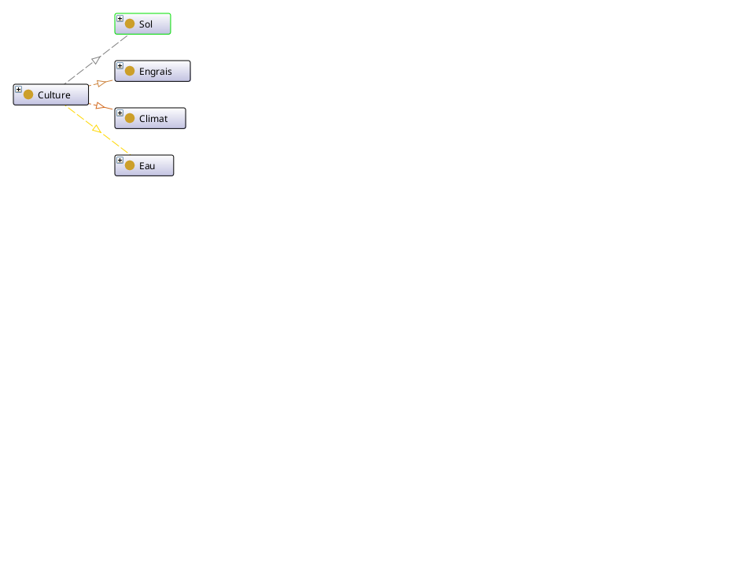

# Notre projet d'ontologie
    
Bienvenue dans mon projet d'ontologie sémantique dédié au domaine de **l'agriculture**.

# 🌱 Ontologie pour l'Agriculture

## 🎯 Domaine choisi

Ce projet consiste à modéliser un domaine lié à l'agriculture en utilisant des technologies sémantiques (RDF, RDFS, OWL, SPARQL, SWRL). L'objectif est de créer une ontologie permettant de gérer des concepts comme les **cultures**, **sols**, **engrais**, **climats**, **irrigation**, et d'autres éléments essentiels à la gestion agricole.

## ✅ Justification du choix

LeLe choix du domaine Agriculture s'explique par plusieurs raisons :

🌱 Pertinence sociétale : L’agriculture est un pilier fondamental pour la sécurité alimentaire, la durabilité environnementale et le développement économique, ce qui en fait un domaine d’étude stratégique et d’intérêt public.

🌾 Richesse conceptuelle : Ce domaine englobe une grande variété d'entités interconnectées telles que les cultures, les sols, les pratiques agricoles, les fertilisants, les conditions climatiques, les maladies des plantes, etc. Cela en fait un excellent candidat pour la modélisation sémantique.

🧠 Utilité pratique : Une ontologie agricole permettrait de :

+ recommander des cultures adaptées en fonction des propriétés du sol, du climat et des nutriments (NPK),

+ structurer des bonnes pratiques agricoles en fonction des cultures ou des saisons,

+ suivre l’évolution de la santé des plantes ou détecter des risques environnementaux (maladies, sécheresse, etc.),

+ optimiser l’utilisation des ressources comme l’eau et les engrais via des systèmes intelligents de conseil.


## 🧠 Concepts clés identifiés

### 🔷 **Classes principales**

| Classe            | Description                                              |
|-------------------|----------------------------------------------------------|
| `Culture`         | Représente les types de cultures agricoles (tomate etc.) |
| `Climat`          | Représente les climats favorables pour les plantes.      |
| `Sol`             | Représente les types de sol selon ses propietés (pH etc.)|
| `Engrais`         | Représente les types d'engrais utilisés pour les cultures|
| `Eau`             | Représente les systèmes d'irrigation aux cultures.       |


## 🔗 Relations entre les concepts (propriétés)

Voici les principales relations définies entre les classes de l’ontologie :

| Propriété          | Domaine → Portée             | Description                                                      |
|--------------------|----------------------------- |------------------------------------------------------------------|
| `utiliseSol`       | `Culture → Sol`              | La culture utilise un sol .                                      |
| `utliseEngrais`    | `Culture → Engrais`          | La culture utilise un engrais .                                  |
| `consommeEau`      | `Culture → Eau`              | La culture utilise un système d'irrigation .                     |
| `aClimat`          | `Culture → Climat`           | Le culture a un climat favorable .                               |

## 🌐 Namespaces utilisés

Afin d'assurer la compatibilité avec les standards du Web sémantique, les namespaces suivants seront utilisés dans notre ontologie :

| Préfixe | URI | Utilisation prévue |
|--------|-----|--------------------|
| `rdf:` | `http://www.w3.org/1999/02/22-rdf-syntax-ns#` | Syntaxe RDF de base |
| `rdfs:` | `http://www.w3.org/2000/01/rdf-schema#` | Définition de classes et propriétés |
| `xsd:` | `http://www.w3.org/2001/XMLSchema#` | Types de données (string, int, date...) |
| `owl:` | `http://www.w3.org/2002/07/owl#` | Modélisation OWL pour classes, restrictions |
| `foaf:` | `http://xmlns.com/foaf/0.1/` |
| `dc:` | `http://purl.org/dc/elements/1.1/` | Métadonnées (titre, créateur, date…) |
| `skos:` | `http://www.w3.org/2004/02/skos/core#` | Vocabulaire hiérarchique ou thématique (ex: catégories de modules) |


## 🖼️ Visualisation de l’ontologie

## 📊 Requêtes SPARQL exécutées avec résultats

### 🔁 Préfixes utilisés dans toutes les requêtes :
```sparql
PREFIX agri: <http://www.example.org/agriculture#>
PREFIX xsd: <http://www.w3.org/2001/XMLSchema#>
PREFIX rdfs: <http://www.w3.org/2000/01/rdf-schema#>
```

---


### ✅ Requête 1 – Apprenants, leurs projets et les technologies utilisées
```sparql
SELECT ?learner ?project ?technology
WHERE {
  ?learner rdf:type :Learner .
  ?learner :producesProject ?project .
  ?project :usesTechnology ?technology .
}
```
| learner  | project               | technology |
|----------|-----------------------|------------|
| Oussema  | Data Analysis Project | Python     |

---

### ✅ Requête 2 – Modules, compétences couvertes et ressources pédagogiques
```sparql
SELECT ?module ?skill ?resource
WHERE {
  ?module :coversSkill ?skill .
  ?module :hasResource ?resource .
  ?module rdf:type :ProgrammingModule .
}
```
| module         | skill         | resource             |
|----------------|---------------|----------------------|
| Python Module  | Python Basics | Intro to Python PDF  |

---

### ✅ Requête 3 – Enseignants, cours enseignés, modules inclus
```sparql
SELECT ?instructor ?course ?module
WHERE {
  ?instructor :teaches ?course .
  ?course :includesModule ?module .
  ?instructor rdf:type :Instructor .
}
```
| instructor   | course                 | module         |
|--------------|------------------------|----------------|
| MrBenSalah   | Data Engineering Course | Spark Module   |
| MrBenSalah   | Data Engineering Course | Python Module  |

---

### ✅ Requête 6 – Lister les cultures triées par rendement décroissant


```sparql
SELECT ?culture ?rendement
WHERE {
  ?culture rdf:type agri:Culture ;
           agri:rendement ?rendement .
}
ORDER BY DESC(?rendement)

```


